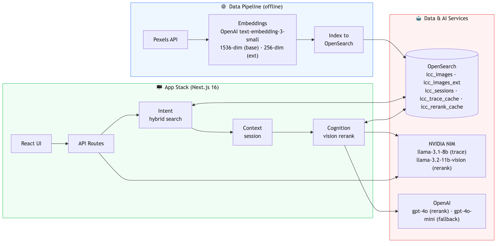

# Reveal — Generative Discovery on OpenSearch

> **Search finds. Reveal discovers.**
>
> A conference demo app built for OpenSearchCon India 2026 · Rajani Maski, Shutterstock

<table>
<tr>
<td>

### Try it live

**[intent-context-cognition-brown.vercel.app](https://intent-context-cognition-brown.vercel.app/)**

Open on your phone or scan the QR code →

</td>
<td>


</td>
</tr>
</table>

---

## What is Reveal?

Reveal is a side-by-side demonstration that makes the difference between legacy keyword search and Generative Discovery impossible to ignore.

The app has two primary views and a set of single-pillar deep dives:

- **Reveal (Layers)** — the opening view. One query, four layers. Start with keyword + synonym expansion. Add Intent (semantic vector). Add Context (session-accumulated vector). Add Cognition (filter + LLM vision rerank). Watch the same result set rebuild at each layer. Green-bordered cards are images the keywords could not reach.
- **Journey** — a multi-step conversational session where all three pillars activate in sequence. Legacy panel resets on every step; Discovery panel evolves. Step 4 shows all three result sets side by side.
- **Intent / Context / Cognition / Precision** — single-query deep dives into each pillar, used to explain mechanisms before the combined views.

The queries are deliberately abstract — *"something melancholy but hopeful"*, *"courage that doesn't look like strength"*, *"make it feel aspirational but not out of reach"* — because those are the queries that expose exactly where keyword search breaks down and where Generative Discovery earns its name.

---

## Purpose

This app was built to answer a single question for a live conference audience:

> *If search and discovery are the same thing, why do results look so different?*

The answer is visible without a single slide or spoken word. The Layers view makes the contrast additive — the audience watches the results change as each pillar switches on. The Journey view shows what happens across a conversation. The agent trace on Cognition queries shows the reasoning out loud.

---

## Tech Stack

| Layer | Technology |
|---|---|
| Frontend + API | Next.js 16 (App Router), TypeScript, Tailwind CSS |
| Deployment | Vercel (130s function timeout) |
| Search backend | Aiven for OpenSearch 3.x (free tier) |
| Image corpus | Pexels API — ~7,500 curated images (standard) / ~17,000 (extended) |
| Embeddings | OpenAI `text-embedding-3-small` — 1536d (standard) / 256d (extended) |
| Hybrid search | OpenSearch normalization pipeline — BM25 (0.1) + kNN (0.9), min-max fusion |
| Filters | Tag-exclusion and aspect-ratio filters applied at the Cognition layer |
| Vision rerank | OpenAI `gpt-4o` judges actual image thumbnails, reranks top-50 → top-6 |
| Rerank cache | `icc_rerank_cache` OpenSearch index — keyed by intent + candidate set |
| Primary LLM (trace) | NVIDIA NIM — `meta/llama-3.1-8b-instruct` |
| Fallback LLM (trace) | OpenAI `gpt-4o-mini` |
| Last-resort trace | Scripted — streamed character by character, no LLM dependency |

### Architecture



---

## The Layers View (Reveal tab)

The Layers view uses each Journey's step 3 — the only step where all three pillars are simultaneously real — as the shared query. Four layers, applied cumulatively:

| Layer | What changes |
|---|---|
| **Keyword + expansion** | Pure BM25, with controlled synonym expansion deliberately drifting toward the wrong cluster. No vector. |
| **+ Intent** | Expansion dropped. Query meaning added as a dense vector (k-NN), fused with BM25 (0.1/0.9). |
| **+ Context** | Vector swapped for the session-accumulated embedding that carries the prior turns of the conversation. |
| **+ Cognition** | Tag-exclusion filter applied. LLM vision rerank (gpt-4o) judges actual thumbnails and promotes the best 6. |

Green-bordered image cards are results that were not in the keyword baseline — visible proof of what each layer surfaces.

A collapsible query trace shows the OpenSearch DSL payload at each layer: keywords, expansion flag, vector source, filter labels, rerank model + cache hit/miss.

---

## The Journey View

Two scenarios: **Creative Director** (mindfulness campaign) and **Developer** (future of work). Each has 4 steps:

| Step | Pillar | What it shows |
|---|---|---|
| 1 | Intent | A feeling encoded as a vector — no useful keyword anchor |
| 2 | Context | Session carries the register from step 1 — it is not re-stated |
| 3 | Cognition | Conflicting modifiers decomposed; agent trace streams; LLM vision rerank applied |
| 4 | Full journey | Three Discovery result sets side by side; closing line delivered by the speaker |

Legacy panel resets on every step (BM25 has no memory). Discovery panel evolves across steps, using a pre-computed `session_accumulated_embedding` for each step.

---

## The Three Pillars (Deep Dive)

### Intent

BM25 treats a query as a bag of words. *"courage that doesn't look like strength"* becomes the keywords `courage strength` — and returns stock photos of athletes and trophies. The word is matched. The meaning is missed.

Discovery embeds the full phrase as a single semantic unit. The vector captures the tension and returns images of quiet determination, small acts, tender moments.

### Context

Real users don't search in isolation. Reveal accumulates a session vector: a weighted average of every embedding in the search history, with more recent queries weighted more heavily:

```
session_vector = weighted_average(prior_embeddings + current_embedding)
                 where weight[i] = 0.7^(n − i)   ← recency decay
```

One context query (`context_04`) demonstrates a **pivot**: *"actually, I want something colder"*. The system subtracts the prior embedding direction:

```
session_vector = session_vector − (0.6 × prior_embeddings[0])
```

### Cognition

Context adds memory. Cognition adds reasoning. When a query is too complex, contradictory, or deliberately underspecified, the agent breaks it down: detects tensions, decomposes into sub-queries, applies negative signal filters, enforces format constraints, activates domain safety filters, admits when it doesn't know.

Every Cognition query streams a live agent trace — labeled as illustrative reasoning — showing how the system decomposed the query. The actual retrieval pipeline (hybrid + filter + vision rerank) runs in parallel.

---

## How Discovery Search Works

Every Discovery result goes through three stages:

**1. Hybrid retrieval (OpenSearch normalization pipeline)**

A BM25 subquery and a k-NN subquery are fused by an OpenSearch normalization-processor pipeline (min-max normalisation, weighted arithmetic mean, 0.1 BM25 / 0.9 vector). Empty-keyword queries use a `match_none` BM25 slot so the fixed-weight pipeline always sees two subqueries. Top 50 candidates retrieved.

**2. Filter stage (Cognition queries and layer 3)**

Aspect-ratio filters and tag-exclusion filters are applied as post-filter clauses. `cognition_02` enforces a landscape orientation filter. Layer 3 of the Layers view applies tag-exclusion filters that were seeded deliberately by the expansion layer to make the contrast visible.

**3. LLM vision rerank**

gpt-4o is called with the actual thumbnail URLs of the top-50 candidates. It ranks them against the original query and returns the top 6. Results are cached in the `icc_rerank_cache` OpenSearch index (keyed by intent + candidate set) so the model is called at most once per query — subsequent requests retrieve the stored order. A RERANK step in the execution trace shows model, cache hit/miss, and candidate count.

---

## LLM Fallback Chain

The agent trace is resilient by design. It never shows an error state on stage.

```
TRACE_MODE=scripted  →  stream pre-written trace immediately (no LLM calls)

TRACE_MODE=live:
  Attempt 1  NVIDIA NIM  meta/llama-3.1-8b-instruct  (2-min timeout)
      ↓ fail
  Attempt 2  NVIDIA NIM  retry                        (2-min timeout)
      ↓ fail
  Attempt 3  OpenAI      gpt-4o-mini                  (2-min timeout)
      ↓ fail
  Final      Scripted trace  →  streamed at 18ms/char, visually identical to live
```

For the conference: `TRACE_MODE=scripted` is the safe default. Switch to `live` if confident in the NVIDIA NIM connection on the day.

---

## Data Pipeline

The pipeline runs offline before the talk. Scripts are in `data-pipeline/`.

```
01_fetch_pexels.py
    Fetches ~8,000 images (standard) across 8 categories
    → pexels_images.jsonl

02_generate_embeddings.py
    Embeds images + all 13 query texts + session prior queries at 1536d
    → pexels_images_embedded.jsonl
    → src/data/queries_standard.json  (embeddings populated)

03_index_opensearch.py
    Recreates icc_images (1536d kNN, HNSW, cosinesimil, nmslib)
    Bulk indexes in batches of 500 — target: 8,000 docs

04_fetch_pexels_extended.py
    Fetches ~20,000 fresh images across 14 categories (all standard + 6 new)
    → pexels_images_ext.jsonl

05_generate_embeddings_256.py
    Same as 02 but at 256d — also embeds 18 extended queries
    → pexels_images_ext_embedded.jsonl
    → src/data/queries_extended.json  (embeddings populated)

06_index_opensearch_extended.py
    Recreates icc_images_ext (256d) — target: 20,000 docs

07_embed_journeys.py
    Embeds journey step display_text values at 1536d and 256d
    Computes session_accumulated_embedding for each step (same 0.7-decay as session.ts)
    Idempotent — skips steps already populated
    Updates both query registries in place

08_prewarm_rerank.mjs
    Pre-warms the LLM vision rerank cache for all registry queries and
    journey steps in both corpora. Run before the talk to ensure zero-latency
    rerank results on stage (all hits, no model calls during the demo).
```

To set up the virtual environment:
```bash
python3 -m venv data-pipeline/venv
source data-pipeline/venv/bin/activate
pip install -r data-pipeline/requirements.txt
```

---

## OpenSearch Indices

### icc_images (standard — 1536d)
```json
{
  "settings": { "index": { "knn": true, "knn.algo_param.ef_search": 100 } },
  "mappings": {
    "properties": {
      "dense_vector": {
        "type": "knn_vector", "dimension": 1536,
        "method": { "name": "hnsw", "engine": "nmslib", "space_type": "cosinesimil",
                    "parameters": { "ef_construction": 128, "m": 16 } }
      }
    }
  }
}
```

### icc_images_ext (extended — 256d)
Same mapping, `dimension: 256`.

### icc_sessions
Session vectors stored as JSON-serialised float array string (`vector_json` keyword field). Application code computes dot product. TTL enforced via `expires_at` field checked on read.

### icc_rerank_cache
Caches LLM vision rerank results. Keyed by `intent_hash` (hash of query text + candidate image_id set). Stores the ranked `image_ids` array and metadata (model, call time, corpus). TTL: 30 days.

---

## Environment Variables

```
# OpenSearch (Aiven)
OPENSEARCH_URL=https://os-9278351-reveal-demo.h.aivencloud.com:13385
OPENSEARCH_USERNAME=avnadmin
OPENSEARCH_PASSWORD=...

# Pexels (data pipeline only)
PEXELS_API_KEY=...

# Embeddings
OPENAI_EMBEDDING_API_KEY=...

# Primary LLM — NVIDIA NIM
NVIDIA_API_KEY=...
LLM_PRIMARY_BASE_URL=https://integrate.api.nvidia.com/v1
LLM_PRIMARY_MODEL=meta/llama-3.1-8b-instruct
LLM_TIMEOUT_MS=120000
LLM_MAX_RETRIES=2

# Fallback LLM + Vision rerank — OpenAI
OPENAI_API_KEY=...
LLM_FALLBACK_BASE_URL=https://api.openai.com/v1
LLM_FALLBACK_MODEL=gpt-4o-mini

# Vision rerank
RERANK_MODEL=gpt-4o
RERANK_DETAIL=low
RERANK_TIMEOUT_MS=30000

# Trace mode: "live" = use LLM chain, "scripted" = stream pre-written trace
TRACE_MODE=scripted

NEXT_PUBLIC_APP_NAME=Reveal
```

---

## Pre-Talk Checklist

- [ ] `icc_images`: 8,000 documents
- [ ] `icc_images_ext`: 20,000 documents
- [ ] All 13 Standard queries return 6 results in both panels
- [ ] All 18 Extended queries return 6 results in both panels
- [ ] Journey A + B: all 3 steps return results; step 4 full journey view renders
- [ ] Layers view: all 4 layers return results for both scenarios in both corpora
- [ ] Rerank cache pre-warmed (`node data-pipeline/08_prewarm_rerank.mjs`)
- [ ] All Cognition traces stream in scripted mode
- [ ] Journey step 3 traces stream in scripted mode (both journeys)
- [ ] Precision@6 scores manually validated and updated in `queries_extended.json`
- [ ] `TRACE_MODE=scripted` set in Vercel env vars
- [ ] QR code generated for `intent-context-cognition-brown.vercel.app`
- [ ] `?speaker=true` tested on presenter device
- [ ] App tested on iPhone (stacked layout, touch navigation)
- [ ] Corpus toggle tested both directions
- [ ] Journey scenario switch tested mid-session

---

## Repository

[github.com/rajanim/intent-context-cognition](https://github.com/rajanim/intent-context-cognition)

Built with Claude Code · OpenSearchCon India 2026
