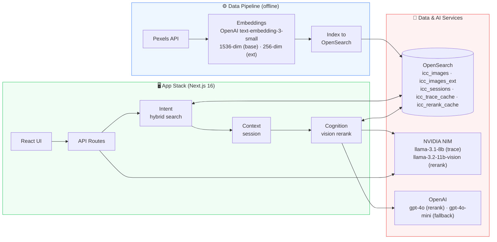

# Reveal — Architecture

Block-style overview: tools in use, data pipeline, and software stack.

## Stack at a glance

| Layer | Tools |
|---|---|
| **Frontend** | Next.js 16 (App Router), React 19, TypeScript, Tailwind CSS 4 |
| **API / server libs** | `/api/search`, `/api/trace`, `/api/session` · query builder, embeddings, guardrails, rerank, session |
| **Search & storage** | OpenSearch (Aiven) — `icc_images`, `icc_images_ext`, `icc_sessions`, `icc_trace_cache`, `icc_rerank_cache` |
| **LLMs** | NVIDIA NIM `llama-3.1-8b-instruct` (primary) · OpenAI `gpt-4o-mini` (fallback) |
| **Vision rerank** | OpenAI `gpt-4o` · NVIDIA `llama-3.2-11b-vision-instruct` |
| **Embeddings** | OpenAI text embeddings (256-dim) |
| **Pipeline** | Python · `opensearch-py`, `openai`, `requests`, `tqdm` · source: Pexels API |
